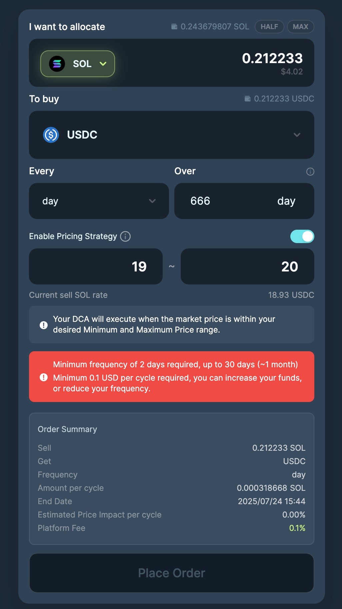

.png)

We are thrilled to announce that **Jupiter DCA is now officially out of beta!** After more than a month of rigorous testing and user feedback, we have incorporated a ton of improvements based on valuable suggestions and ideas from partners and users to increase platform stability and add more features.

## **Quick summary of the latest DCA upgrade:**

- **Advanced Pricing Strategy:** Introducing Min/Max parameters for users to define a precise, user-defined executable price range. This gives users more control over their investments and helps them avoid buying or selling at unfavorable prices.

- **Expanded Tradable Tokens:** Now offering access to over 600 tokens listed on the Jupiter Strict Token List, giving users a significant increase in token selection from the initial Top 20 tokens.

- **Any-to-Any Token Trading Pairs:** Enabling trading between any-to-any token pairs for more diverse trading options.

- **Metis Algorithm Implementation:** Leveraging the Metis algorithm for enhanced routing and improved pricing.

- **Increased Global Upper Limit:** We have increased the global upper limit for a single DCA order from $5,000 USD to $20,000 USD. This change offers users more flexibility for a wider range of use cases.

- **Tweaked Default Slippage Rate:** Adjusting the default slippage rate to 10 basis points (bps) for improved transaction rates.

- **Optimized Order Fulfilment:** The default slippage rate has been adjusted to 10 basis points (bps) for an improved and better transaction fulfillment rate.

- **Additional Checks and Warnings:** Implementing further checks and warnings to enhance safety and security for users.

- **Enhanced Safety Mechanism:** Verification of the scheduled date/time and validation of available tradable tokens on Jupiter Strict token list to add an extra layer of security for users when trading new tokens. 

## Advanced Pricing Strategy

One of the most eagerly requested additions from our users and partners is the introduction of a Min/Max parameter or Advanced Pricing Strategy, addressing the need for precise control. This feature is implemented at the contract level, empowering users to define a minimum price for selling and a maximum price for buying within their DCA orders, adding an extra layer of security for more precise order execution. This strategy ensures order execution within a user-defined price range. If the price falls outside the range during the execution, Jupiter will reattempt to fill your order at a later time till successful, while also enforcing our randomiser at a later time so your trade remains unpredictable. 

.jpg)
*The example above sets both the minimum and maximum prices for the DCA order to be executed.*

- Minimum price - $19 
- Maximum price - $20 

So in this scenario, if the **SOL price is within $19-$20**, the DCA will execute the order, and if it *falls below* or *pump above* the range, Jupiter will retry at a later time to try to check with the price, and if it is within the user-defined range, Jupiter will attempt to execute the order while enforcing our randomiser so your trade remains unpredictable.

## Expanded Tradable Token Selection

Additionally, we've significantly broadened our range of supported tokens, expanding from the **top 20 traded tokens on Jupiter's list to encompass over 600 tokens**. This expansion is backed by the community-verified [Jupiter Strict Token List](/docs/token-list/token-list-api).

## Any-to-any token trading pairs & Metis Algorithm Implementation

In line with our extensive Metis-powered enhancements, DCA now effortlessly enables trading between any-to-any pairs with improved routing and pricing efficiency.

Metis, our powerful routing engine, dynamically operates on a vast scale. It optimizes routes by splitting and merging input and output tokens, ensuring the best prices for even more complex trades. This enhanced efficiency opens doors to a broader range of intermediary tokens while keeping costs minimal, just a fraction of a cent.

## Minimum Frequency and Maximum Cycle Settings

Introducing settings that allow for a maximum duration of one year to meet specific trading needs.

We have a suggestive text that explains each min and max frequency for each iteration, this will make the frequency input feel more natural and it will always show the frequency error message if input falls out of bounds or when the wallet is not connected or no input value.

- Minute → 2 - 1440 minutes (~ 1 day)
- Hour → 2 - 168 hours (~1 week)
- Day → 2 - 30 days (~1 month)
- Week → 2 - 52 weeks (~1 year)
- Month → 2 - 12 months (~1 year)

## How Jupiter DCA works
When you set up a DCA order, your chosen tokens get moved from your wallet to a special account owned by the DCA program. Imagine it like putting your tokens in a vault. The first order happens right after you create your DCA, and then more orders come in at the times you pick. So, if you're DCA-ing 1,000 $USDC into $SOL every day for 10 days, the first 100 $USDC -> $SOL order goes through when you start, and you'll have 9 more daily orders to go.

Read more details here https://station.jup.ag/guides/dca/how-dca-work 

## Join us!

These measures collectively strengthen the safety and effectiveness of Jupiter DCA, enhancing your experience while reducing potential risks. Your trust and feedback propel us forward, and we are committed to refining and expanding DCA's capabilities. We are dedicated to providing a seamless and secure environment for your DCA journey. Join us on this exciting path and stay informed within our active community. https://discord.gg/jup